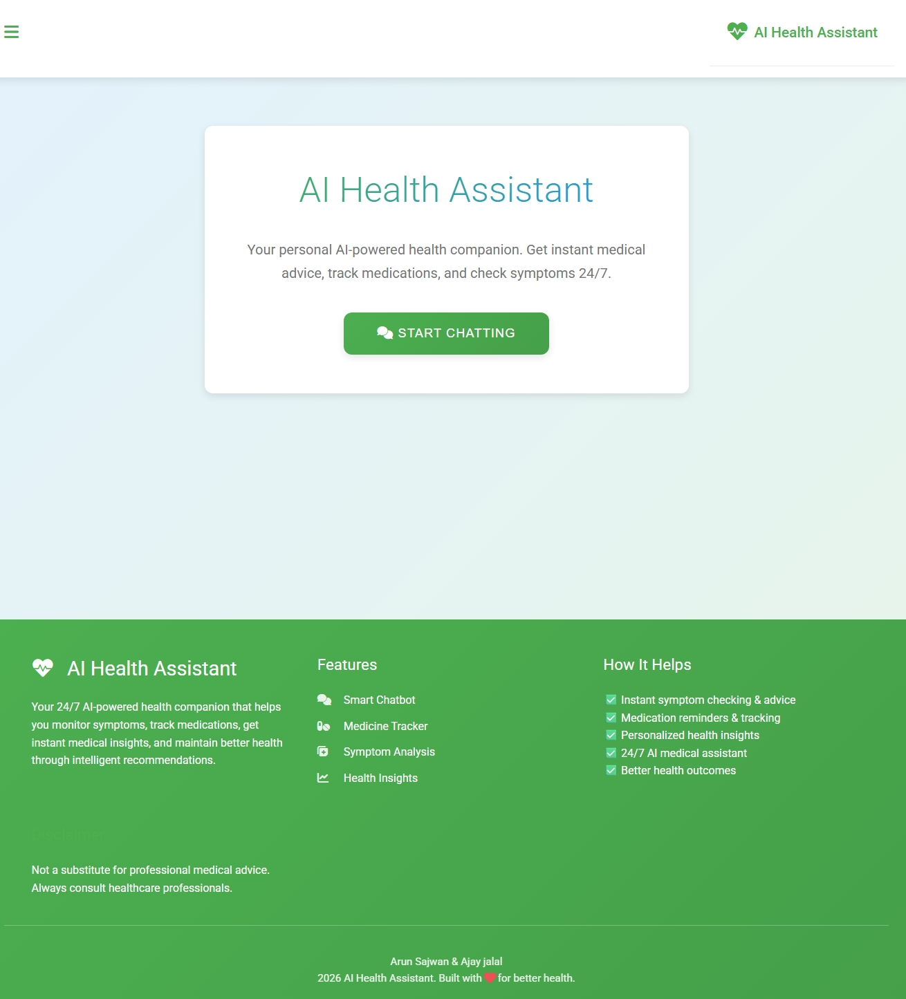
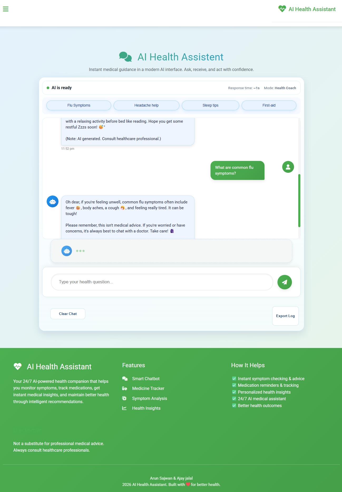
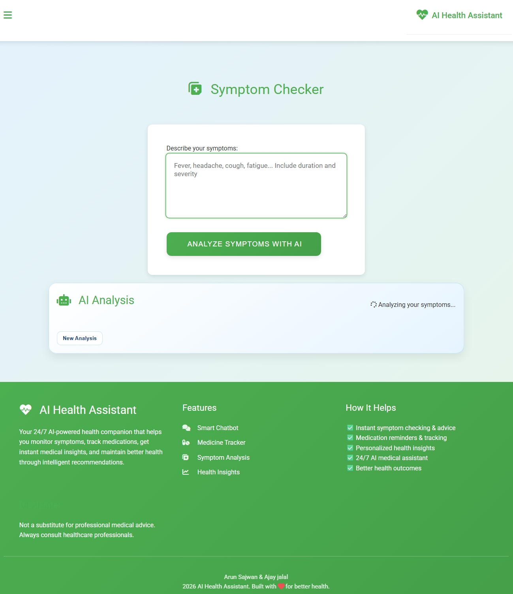
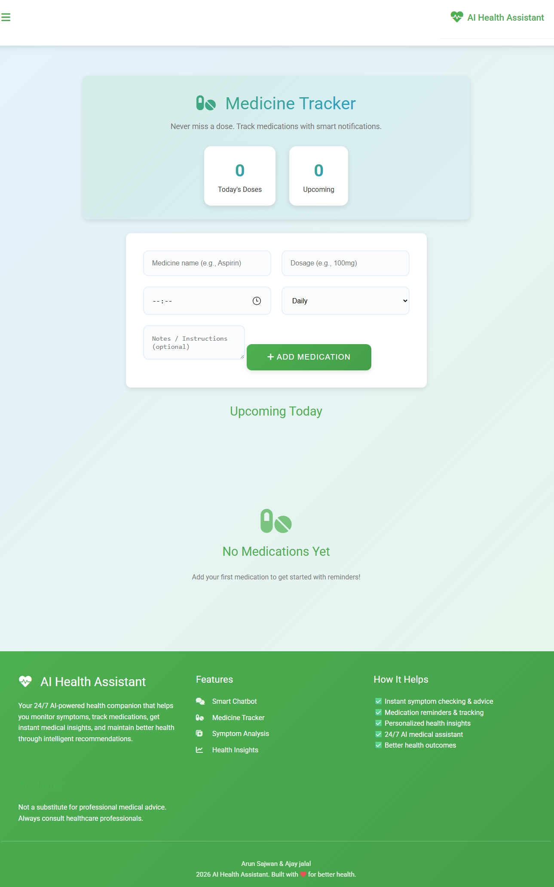

# AI Health Assistant

[](https://www.python.org/downloads/)
[](https://flask.palletsprojects.com/)

## 🚀 Overview

**AI Health Assistant** is a modern, responsive web application powered by Google Gemini AI. It provides 24/7 health support through:
*Codecure - AI Hackathon*

- **AI Chatbot**: Instant medical guidance and health queries
- **Symptom Checker**: AI-powered symptom analysis
- **Medicine Tracker**: Track medications with notifications
- **Profile Management**: User settings
- **Dark/Light Mode**: Responsive design for all devices


## ✨ Features

- 🎯 **Smart AI Chatbot** - Real-time health conversations via Gemini AI
- 🩺 **Symptom Analysis** - Describe symptoms, get possible conditions & precautions
- 💊 **Medicine Tracker** - Add medications, set reminders, mark as taken
- 📱 **Fully Responsive** - Mobile-first design with sidebar navigation
- 🌙 **Dark/Light Theme** - Automatic theme switching
- 💾 **Local Storage** - Persistent chat history & medication data
- 📤 **Chat Export** - Download conversation logs

## 🛠 Tech Stack

| Frontend | Backend | AI | Styling | Other |
|----------|---------|----|---------|--------|
| HTML5 | Flask | Google Gemini 2.5 Flash | CSS3, Font Awesome | LocalStorage, Notifications |
| Vanilla JavaScript | CORS | `.env` API Key | Google Fonts (Roboto) | Service Workers Ready |

## 📁 Project Structure

```
chatgpt/
├── screenshot                  # pages screenshots
├── index.html                  # Main app (SPA with page switching)
├── script.js                   # Core logic (nav, chat, forms, storage)
├── ai.py                       # Flask backend + Gemini AI
├── style.css                   # Base styles
├── chatbot-styles.css          # Chatbot UI
├── medicine-styles.css         # Medicine tracker styles
├── symptom-style.css           # Symptom checker styles
├── mobile-nav-improvements.css # Mobile responsiveness
└── README.md                   # This file
```


## 🚀 Quick Start

### 1. Prerequisites
- Python 3.8+
- Google Gemini API Key ([Get Here](https://aistudio.google.com/app/apikey))

### 2. Setup Backend
```bash
cd "c:/Users/Family/Downloads/AI Health Assistant"
# Create virtual environment
python -m venv venv
venv\Scripts\activate

# Install dependencies
pip install flask flask-cors google-generativeai python-dotenv

# Create .env file
echo GEMINI_API_KEY=your_api_key_here > .env
```

### 3. Run Backend
```bash
python ai.py
```
Backend runs on `http://127.0.0.1:5000`

### 4. Open Frontend
```bash
# In browser, open index.html
# Or use Live Server extension in VSCode
```

### 5. Test Features
- Chat: Ask "What are flu symptoms?"
- Symptoms: "I have fever and cough for 2 days"
- Medicine: Add "Aspirin 100mg at 8:00 AM"

## 🔧 API Endpoints

```
POST http://127.0.0.1:5000/chat
{
  "message": "user query",
  "feature": "chat|symptom|diet|medcheck"
}
```

**Response**:
```json
{
  "reply": "AI response + disclaimer"
}
```

## 🧪 Development

### Frontend
- Edit `index.html`, `script.js`, CSS files
- Uses modern ES6+ JavaScript
- No build step required

### Backend
- `ai.py`: Flask server
- Add features by extending `/chat` route
- Logs to console

### Customization
1. **Change AI Model**: Edit `genai.GenerativeModel("gemini-2.5-flash")`
2. **API Key**: Secure in `.env`
3. **Styling**: Multiple CSS files for modular theming
4. **New Features**: Add pages in HTML, handlers in `script.js`

## 📱 Screenshots

**Home & Chatbot**  
 

**Symptom Checker**  


**Medicine Tracker**  


*(Add your screenshots here)*

## 🤝 Contributing

1. Fork the repo
2. Create feature branch (`git checkout -b feature/medicine-tracker`)
3. Commit changes (`git commit -m 'Add medicine snooze'`)
4. Push & PR

## ⚠️ Limitations & Disclaimer

- **Not medical diagnosis** - Educational/AI demo only
- Client-side storage (no cloud sync)
- Single-user (localStorage)
- Browser notifications require permission
- Gemini API costs apply for heavy usage

## 📄 License

MIT License - see [LICENSE](LICENSE) for details.

## 👥 Authors

- **Arun Sajwan**
- **Ajay Jalal**

Built with ❤️ for better health awareness. Questions? Check console logs or extend the code!

---


